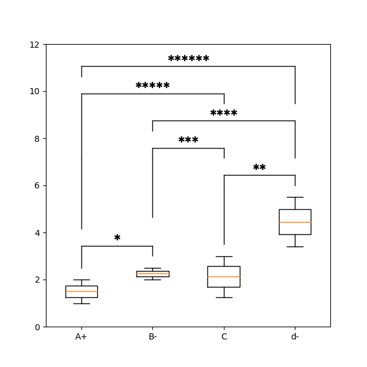

Playfair
========

Introduction
------------

Playfair is a utility package to help with common tasks for research papers.
It's named after William Playfair, credited with creating a number of important visualization tools still used today.

Features
--------

Currently, Playfair provides graphical tools for data visualization, with special focus
for the kinds of plots commonly used in scientific papers in the biomedical sciences and
utilities to display data as part of Microsoft Word files.

Graphical Tools (using matplotlib)
~~~~~~~~~~~~~~~~~~~~~~~~~~~~~~~~~~

Docx Tools (interact with Microsoft Word files)
~~~~~~~~~~~~~~~~~~~~~~~~~~~~~~~~~~~~~~~~~~~~~~~~

**TODO**

Contributing
------------

The scope of this package isn't currently well defined.
Contributions are welcome, including documentation improvements.
While 100% code coverage isn't necessary, code contributions should come with *some* testing coverage.
