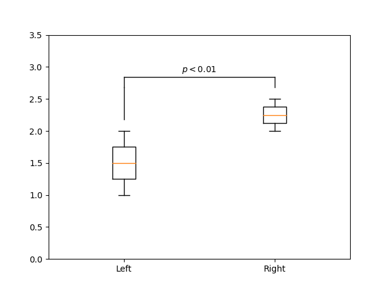
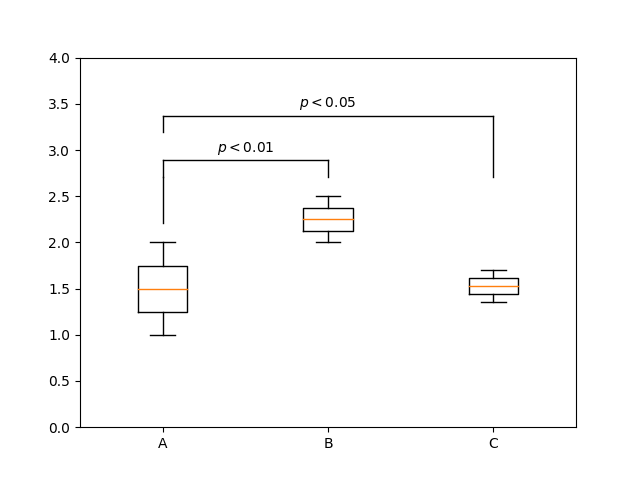

Playfair
========

Introduction
------------

Playfair is a utility package to help with common tasks for research papers.
It's named after William Playfair, credited with creating a number of important visualization tools still used today.

Features
--------

Currently, Playfair provides graphical tools for data visualization, with special focus
for the kinds of plots commonly used in scientific papers in the biomedical sciences and
utilities to display data as part of Microsoft Word files.

Graphical Tools (using matplotlib)
~~~~~~~~~~~~~~~~~~~~~~~~~~~~~~~~~~

Examples
''''''''

**Example 1:** Plotting a single comparison marker.

.. code:: python

    from playfair.compare import add_comparisons_to_axes, Comparison, stars
    from matplotlib import pyplot as plt
    import numpy as np

    # Generate some data
    d1 = np.linspace(1, 2, 55)
    d2 = np.linspace(2, 2.5, 34)

    # Create a comparison marker between populations at the positions 1 and 2.
    comparison_marker = Comparison("$p < 0.01$", d1, d2, 1, 2)

    fig, ax = plt.subplots(1)
    # Add a normal boxplot
    ax.boxplot([d1, d2], labels=["Left", "Right"])
    add_comparisons_to_axes(ax, [comparison_marker])

    # Set the ylims manually because matplotlib isn't smart enough
    # to scale things such that the markers fit in the plot
    ax.set_ylim(0, 3.5)
    fig.savefig('docs/_static/images/example1.png')

**Example 2:** Plotting two comparison markers.

.. code:: python

    from playfair.compare import add_comparisons_to_axes, Comparison, stars
    from matplotlib import pyplot as plt
    import numpy as np

    # Generate some data
    d1 = np.linspace(1, 2, 55)
    d2 = np.linspace(2, 2.5, 34)
    d3 = np.linspace(1.35, 1.70, 55)

    # Create a comparison marker between populations at the positions 1 and 2.
    comparison_marker_1 = Comparison("$p < 0.01$", d1, d2, 1, 2)
    # Create a comparison marker between populations at the positions 1 and 3.
    comparison_marker_2 = Comparison("$p < 0.05$", d1, d2, 1, 3)

    fig, ax = plt.subplots(1)
    # Add a normal boxplot
    ax.boxplot([d1, d2, d3], labels=["A", "B", "C"])
    add_comparisons_to_axes(ax, [comparison_marker_1, comparison_marker_2])

    # Set the ylims manually because matplotlib isn't smart enough
    # to scale things such that the markers fit in the plot
    ax.set_ylim(0, 4)
    fig.savefig('docs/_static/images/example2.png')

**Example 3:** Comparison markers using stars.
Highlights the ability to plot many comparison markers without overlapping.
Not the use of the `star()` function.

.. code:: python

    from playfair.compare import add_comparisons_to_axes, Comparison, stars
    from matplotlib import pyplot as plt

    d1 = np.linspace(1, 2, 55)
    d2 = np.linspace(2, 2.5, 34)
    d3 = np.linspace(1.25, 3, 40)
    d4 = np.linspace(3.4, 5.5, 50)

    # Text above the comparison marker will be a single star...
    comp1 = Comparison(stars(1), d1, d2, 1, 2)
    # ... two stars ...
    comp2 = Comparison(stars(2), d3, d4, 3, 4)
    # ... etc.
    comp3 = Comparison(stars(3), d3, d4, 2, 3)
    comp4 = Comparison(stars(4), d2, d4, 2, 4)
    comp5 = Comparison(stars(5), d1, d3, 1, 3)
    comp6 = Comparison(stars(6), d1, d4, 1, 4)
    comps = [comp1, comp2, comp3, comp4, comp5, comp6]

    fig, ax = plt.subplots(1)
    # Add a normal boxplot
    ax.boxplot([d1, d2, d3, d4], labels=["A+", "B-", "C", "d-"])
    add_comparisons_to_axes(ax, comps)

    # Set the ylims manually because matplotlib isn't smart enough
    # to scale things such that the markers fit in the plot
    ax.set_ylim(0, 12)

Output:

.. image:: docs/_static/images/output-example-1.png

Docx Tools (interact with Microsoft Word files)
~~~~~~~~~~~~~~~~~~~~~~~~~~~~~~~~~~~~~~~~~~~~~~~~

**TODO**

Contributing
------------

The scope of this package isn't currently well defined.
Contributions are welcome, including documentation improvements.
While 100% code coverage isn't necessary, code contributions should come with *some* testing coverage.
